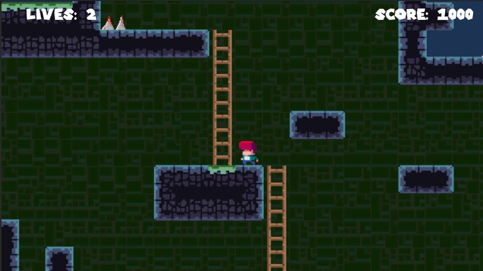

# TileVania 🏔️

<center>
</img>
</center>

TileVania es un juego de plataformas en 2D desarrollado en Unity. El proyecto está diseñado como un ejemplo práctico de juego de plataformas utilizando tilesets y otras herramientas clave en el desarrollo de videojuegos."

## Características 📋

- Plataformas en 2D.
- Uso de tilesets para la creación de niveles.
- Controles básicos de movimiento y salto.
- Ejemplo de animaciones y física en Unity.

## Instalación y Uso 🛠️

1. Clona el repositorio en tu máquina local:

   ```bash
   git clone https://github.com/danielmaavre/TileVania.git

2. Abre el proyecto en Unity (recomendado usar la versión 2022.3 o superior).

    Ejecuta la escena principal para comenzar a jugar.

3. Uso 🕹️

- Movimiento: Usa las teclas de flechas o WASD para mover al personaje.
- Salto: Presiona la barra espaciadora para saltar.
- Ataque: click izquierdo


## Contribuciones 🤝

Actualmente el juego cuenta con 3 niveles!

¡Las contribuciones son bienvenidas! Si deseas mejorar el juego o añadir nuevas características, por favor abre un issue o envía un pull request.